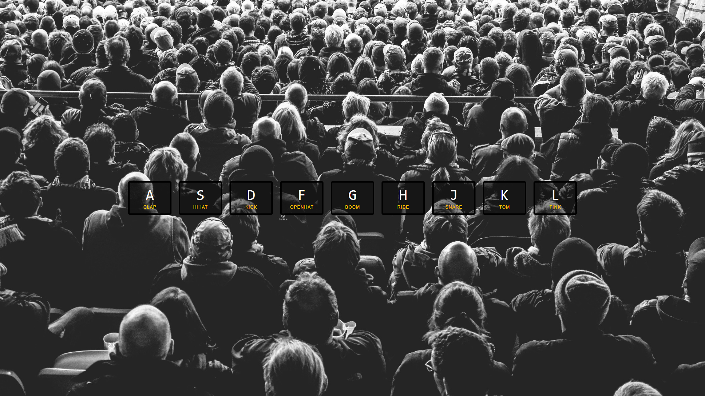

# Drum Kit
> An application with which to create fun melodies

## Table of contents
* [General info](#general-info)
* [Screenshots](#screenshots)
* [Technologies](#technologies)
* [Status](#status)
* [Contact](#contact)

## General info
An application with which you can create various melodies by pressing the corresponding keys on the keyboard

## Screenshots

## Technologies
* HTML5
* CSS3
* JavaScript/ES6

## Status
Project is: _finished_ _for_ _now_

## Contact
Created by [@Dan](https://www.linkedin.com/in/danail-kostov-ba95b81b3/) - feel free to contact me